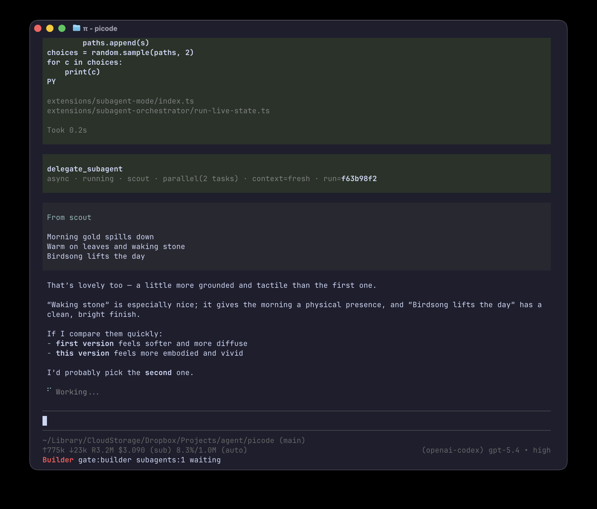

A homage to OpenCode in Pi!

npm: https://www.npmjs.com/package/@judepayne/picode



`picode` is a Pi package for running Pi with a disciplined, role-based workflow that still feels fast and powerful.

It gives you named runtime modes — **Builder**, **Planner** and **Designer** — plus delegated **subagents** such as scout, worker and reviewer. Switch modes with `Ctrl + ,` and `Ctrl + .`, or dispatch a subagent directly with `~scout`, `~worker`, `~reviewer`.

Picode's goal is to give you a significant boost whilst remaining unobtrusive.

---

## What problem does this solve?

Without picode, design, planning, implementation and review all collapse into one blurry prompt. One agent does everything with the same permissions, the same model, the same tools, and the same voice — so nothing signals when it is safe to mutate files, when to stop and think, or when to explore tradeoffs instead of jumping straight to code.

Picode splits those concerns into **runtime modes**. You switch between specialist **agents** — Designer, Planner and Builder — each with its own prompt, tools, model preference, permission profile and communication style. Builder is short and to the point. Designer is warm and discursive. Planner is analytical and scoped. The prompt tells the agent how to behave; the gate tells it what it is allowed to do.

You are not just telling Pi to "act like a planner." You are putting it into a runtime that behaves like one.

On top of that, the active agent can delegate bounded work to **subagents** — scout, worker and reviewer — which are not role-play prompts but standalone utilities with their own instructions, tools and gate profiles. They run independently and hand back structured results, so the main agent stays focused while the specialist does the reconnaissance, implementation, or review.

None of this is baked in. Every agent and subagent is just a markdown file. Don't like the shipped set? Change them, delete them, or add your own specialist subagents.


**The parts of the whole:**

- **agent-mode** an extension for mode switching and persona prompts
- **pi-gate** an extension for OpenCode-style permission profiles
- **subagent-orchestrator** an extension for mediated delegation to/ monitoring of package-defined subagents
- **subagent-mode** an extension that provides the child-runner substrate behind delegation
- **z-prompt-vars** an extension for prompt interpolation and runtime vars
- **skills** that teach the agent how to use the package well
- **agent-assets** an extension for resolving the built-in and user-overlay agent/subagent cards that define the shipped modes and delegated personas

---

## Contents

- [Install and first run](#install-and-first-run)
- [How picode works](#how-picode-works)
- [The default workflow](#the-default-workflow)
- [Agents](#agents)
- [Subagents](#subagents)
- [Prompt vars and plan/design files](#prompt-vars-and-plandesign-files)
- [Customising picode](#customising-picode)
- [Recipe: building a custom subagent team](#recipe-building-a-custom-subagent-team)
- [Files and state](#files-and-state)
- [Troubleshooting](#troubleshooting)
- [Further reading](#further-reading)

---

## Install and first run

Install the published npm package. This is the preferred install route:

```bash
pi install npm:@judepayne/picode
```

Package page: https://www.npmjs.com/package/@judepayne/picode

Reload Pi:

```text
/reload
```

Bootstrap the prompt-vars files if you want to create them explicitly:

```text
/vars bootstrap
```

The extension also auto-bootstraps missing vars files on session start. Bootstrap creates:

- `<cwd>/.pi/agent-mode-vars.json`
- `<cwd>/.pi/agent-mode-vars-config.json`
- `~/.pi/agent/agent-mode-vars.json`

It seeds:

- `paths.plan = ".pi/plans/active.md"`, unless a global `paths.plan` already exists
- `paths.design = ".pi/designs/active.md"`, unless a global `paths.design` already exists
- `subagents.dispatch.defaultContext = "fresh"`
- `automode.enabled = false`
- `pi-location = "project"`

Once that is done, a good quick smoke test is:

```text
/agents
/agents Designer
~scout find every place where config is loaded
```

---

## Quick reference

| What you want | How |
|---|---|
| See current agent | `/agents` |
| Switch agent | `/agents <name>` or `Ctrl + ,` / `Ctrl + .` |
| Start automode from Designer | `/automode` or `/automode on` |
| Run a subagent directly | `~scout <task>`, `~worker <task>`, `~reviewer <task>` |
| Delegate through the active agent | Just ask in plain English |
| Check / set prompt vars | `/vars` or `/vars set <key> <value>` |
| Bootstrap missing vars files | `/vars bootstrap` |
| Check active plan or design | Ask the agent: "Show me the active plan" |
| Reference plan or design in prompts | `${plan.path}` or `${design.path}` |

---

## How picode works

Picode turns one Pi session into a small, structured system.

First, the main agent runs in one of several named **agents** such as Builder, Planner, or Designer. Each agent has its own prompt, tools, preferred model settings, optional direct subagent bans, and permission profile.

Second, permissions are enforced separately from persona through **pi-gate**. That matters. The prompt and agent-card metadata tell the agent how it should behave; pi-gate is the control layer that decides what it is actually allowed to do. In practice, switching agent also switches gate profile, so Builder can be broadly mutating, Planner can be read-mostly, and Designer can be constrained to design artefacts and scratch files.

Pi-gate rules resolve to `allow`, `ask`, or `deny`. For the top-level agents, that gives you a useful balance: permissive where it should be, interactive where it would be risky, and blocked where it should never happen.

Third, the main agent can delegate bounded work to **subagents** such as scout, worker, and reviewer. Those subagents are not role-play. They run from their own markdown cards with their own tools and instructions.

Fourth, prompts can interpolate project-aware values such as the active plan path and design path. That keeps prompts portable and lets the shipped agents adapt to the current workspace without hardcoding absolute paths.

The result is a package that gives Pi more structure without forcing a heavy workflow on top of you.

---

## The default workflow

The default rhythm is simple:

1. **Designer** shapes the approach.
2. **Planner** turns that into a concrete handoff.
3. **Builder** makes the change.
4. **reviewer** checks non-trivial implementation work when needed.

If the task is tiny, you can skip straight to Builder. If the task is fuzzy, start with Designer. If the path is clear but the work is still non-trivial, Planner is usually the right next stop.

When a design is complete, Designer can also start explicit automode. Run `/automode` from Designer to set `automode.enabled=true` and let the modes hand off through Designer → Planner → Builder using system-generated handoff turns. Automode cannot be started from Planner or Builder, and natural-language prompts do not trigger it.

---

## Agents

Use `/agents` to inspect the current agent and switch between them.

```text
/agents
/agents Designer
/agents Planner
/agents Builder
```

You can also cycle with `Ctrl + ,` and `Ctrl + .`

The shipped agents are:

### Designer

Use Designer when the problem is still taking shape.

Designer is for:
- architecture
- interfaces
- boundaries
- tradeoffs
- shaping the work before code changes

### Planner

Use Planner when you know what should happen and want an implementation-ready handoff.

Planner is for:
- clarifying scope
- sequencing the work
- grounding the plan in the actual repo
- writing the active plan

### Builder

Use Builder when the task is ready to implement.

Builder is for:
- code changes
- focused validation
- using subagents when they genuinely help

A key point: agents are markdown files. If you want a different style, different rules, or a completely different set of roles, you can change them.

The built-in agent definition files live in `extensions/agent-assets/agents/`. Each file is a markdown card with frontmatter for things like the name, tools, gate profile, optional `banned_subagents`, model, and thinking level, followed by the body prompt that actually defines the agent's behaviour.

When you build a new one, keep the role sharp and pair the prompt with the right tools and gate profile; vague overlap between agents tends to blur their behaviour. Also note that the number at the start of the filename sets the order the agents appear in Pi, so files like `01-builder.md`, `02-planner.md`, and `03-designer.md` are shown in that order.

---

## Subagents

Subagents are delegated helpers. The shipped set is:

- `scout` for reconnaissance
- `worker` for bounded implementation or validation work
- `reviewer` for an independent review pass

Like agents, subagents have their own settings: tools, model, thinking level, body prompt, and `maxSubagentDepth`.

You can invoke them directly from the prompt line:

```text
~scout inspect how config is loaded
~worker implement the smallest safe fix and run the relevant test file
~reviewer inspect the current working tree diff and report findings by severity
```

Or you can just ask the current agent to orchestrate the work for you in plain English.

Subagents can run sync or async. Direct `~subagent` use is async and lightweight by design.

They also sit under their own gate profiles. This is where the permission story gets more interesting. The shipped subagent profiles are marked as **unattended**, which means they are designed to run without stopping for interactive `ask` decisions mid-flight. In practice that means the profiles lean toward explicit `allow` or `deny` rules instead.

For example:

- `scout` is tightly read-oriented, can write only to orchestrator artifact locations when needed, and has `maxSubagentDepth: 1`
- `worker` is allowed to mutate files but has sharp denials around things like `git push`, `sudo`, and pipe-to-shell download patterns, and has `maxSubagentDepth: 0`
- `reviewer` is read-only in spirit and does not edit files, with `maxSubagentDepth: 0`

That combination is important: prompt, tools, gate profile, and depth limit all reinforce the intended role.

A few example patterns:

```text
~scout inspect how config is loaded
```

```text
Create a reviewer subagent, run it sync on the current working tree diff, and give me the findings by severity.
```

```text
Spawn three scout subagents in parallel and run them async: one for the API layer, one for persistence, and one for frontend state. Then bring back a concise comparison.
```

```text
Run a sync chain: first scout the parser code path, then have a worker implement the smallest safe fix, then have a reviewer inspect the diff and summarize any remaining risks.
```

Important details:

- `~subagent` must be at the start of the first line
- known subagents are available unless the current agent lists them in `banned_subagents`
- `--fresh`, `--fork`, and `--continue` control delegation context
- the default direct-dispatch context is configured through prompt vars and defaults to `fresh`

Like agents, subagents are just markdown cards. You can add your own specialists instead of forking the runtime.

---

### Monitoring subagents

Picode surfaces delegated work through three layers:

- **Launch notification** — a brief confirmation that the subagent started (e.g. "Scout running in background"). Healthy user-started runs do not stay pinned.
- **Footer tree** — compact tree status for background activity. It uses `● root >` when the root is selected, `●` for the selected tapped child, `r1` / `r2` for run roots, `>` for recursive nesting such as `root > r1 > scout 1 > worker 1`, `|` for multiple root trees, `→` for chains, and `,` for parallel siblings. Node color indicates lifecycle: running (`#71e37d`), queued (`#f0c986`), complete (`#bababa`), cancelled (`#874a4a`), and failed (`#FF4D4D`). These defaults can be overridden with z-prompt-vars under `footer.colors.subagentStatus.*`; the bold root separator defaults to `#1e69e3` and can be overridden with `footer.colors.subagentSeparator`.
- **Run cards** — detailed per-run view when explicitly requested or when `showRunCard: true` is set. Shows the current task, active/finished children, live tool usage, session file locations, recent output, and final summary.

When something fails, ask the main agent to inspect it:

```text
Investigate the failed worker.
A scout failed. Find out why and tell me whether to retry it.
```

The `subagent-orchestrator` extension provides the behind-the-scenes monitoring tools the agent uses to investigate on your behalf.

---

## Prompt vars and plan/design files

Picode uses `z-prompt-vars` so prompts can refer to project-aware values such as:

- `${plan.path}`
- `${design.path}`
- `${plan.exists}`
- `${design.exists}`
- `${automode.enabled}`

By default those paths resolve to:

- `.pi/plans/active.md`
- `.pi/designs/active.md`

The vars system reads project values first and global values second, so workspace overrides win.

Useful commands:

```text
/vars
/vars bootstrap
/vars plan.path
/vars set project.name "My Project"
/vars location
/vars location global
```

For most users, the session-start auto-bootstrap is enough to get started; `/vars bootstrap` runs the same bootstrap explicitly.

---

## Customising picode

There are three main ways to customise the package.

### 1. Edit or add agent cards

Built-in agent cards live under:

- `extensions/agent-assets/agents/`

These define top-level agents such as Builder, Planner, and Designer.

### 2. Edit or add subagent cards

Built-in subagent cards live under:

- `extensions/agent-assets/subagents/`

These define delegated specialists such as scout, worker, and reviewer.

### 3. Add user overlays

Instead of editing the shipped package files directly, you can point picode at your own overlay directories through Pi settings.

In `.pi/settings.json` or `~/.pi/agent/settings.json`:

```json
{
  "picode": {
    "agentsDir": "./custom-agents",
    "subagentsDir": "./custom-subagents"
  }
}
```

That lets you keep your own house style while still using the rest of the package.

A user file with a different filename is added as a new card. A user file with the same filename as a built-in card partially overrides that built-in card by shallow map merge: supplied frontmatter keys replace built-in keys, blank values inherit, and a non-empty body replaces the prompt entirely.

For example, `custom-agents/01-builder.md` can contain only:

```md
---
banned_subagents: expensive-specialist
---
```

That keeps the built-in Builder prompt and all other Builder settings, but blocks direct delegation from Builder to that subagent. Bans are not inherited by delegated children.

### Minimal agent card example

Agent cards are markdown files with flat YAML-style frontmatter. Here is the smallest useful example:

```md
---
name: MyAgent
profile: builder
color: "#3366CC"
tools: all
ban_tools: [edit, write]
banned_subagents: expensive-specialist
bash: full
thinking: -
model: -
---

Your prompt body goes here. This text is what the agent actually sees as its instructions.
```

What each key does:

- `name` — the display name shown in `/agents` and the footer.
- `profile` — the pi-gate permission profile (e.g. `builder`, `planner`, `designer`). Controls what the agent is allowed to do.
- `color` — the accent colour for the agent’s UI elements. Hex or named colours.
- `tools` — the base tool selection for this card. Use an explicit list or `all`. For top-level agents, omitting `tools` means `all`.
- `ban_tools` — a subtractive list applied after `tools` is resolved.
- `banned_subagents` — optional non-inherited direct delegation bans for known subagents. Use `-` or omit the field for no bans.
- `bash` — `full` or `read-only` mode intent for agent-mode. `read-only` is a lightweight guardrail for obvious mutating shell commands, not a security boundary. Authoritative bash/file permissions are enforced by pi-gate policy.
- `thinking` — the default thinking level (`off`, `minimal`, `low`, `medium`, `high`, `xhigh`). Use `-` to leave it unset.
- `model` — the preferred model. Use `-` to leave it unset.
- `extensions` — subagent cards only: additional child extension paths to load on top of picode's default child extension set.
- `maxSubagentDepth` — optional delegation depth cap. If omitted, the current inherited/default cap applies. `0` means the agent/subagent may run but cannot delegate further.

`model` and `thinking` are optional. If you leave them out, leave them blank, or set them to `-`, picode falls back to your current Pi settings, which is useful if you want the same agent to run on different models depending on context.

The frontmatter controls runtime behaviour; the markdown body is the persona prompt. Save the file in your overlay directory (or `extensions/agent-assets/agents/` if you are editing the package directly) and run `/reload`.

Tool-selection semantics differ slightly by card type:

- top-level agent cards: omitted `tools` means `all`
- subagent cards: omitted `tools` means inherit the parent agent's current active tools
- in both cases, omitted `ban_tools` means no subtraction

For delegated subagents, inherited tools are still limited by what the child runtime actually loads. If a parent has a tool that the child runtime does not load, the child simply ignores that name.

Depth caps are inherited and only get stricter as delegation nests: a child-specific `maxSubagentDepth` is bounded by the parent/current cap, and omitted values inherit that cap.

Subagent cards can opt into extra child extensions without replacing picode's default child extension set. Use a single path or an inline comma list:

```yaml
extensions: ~/.pi/agent/extensions/openai-web-search.ts
```

If an added extension registers Pi tools, list those tool names explicitly in `tools` when the subagent needs them.

For full working examples, see the built-in cards in `extensions/agent-assets/agents/` and `extensions/agent-assets/subagents/`.

---

## Recipe: building a custom subagent team

Picode's subagent system is not limited to the shipped set. You can build your own specialist subagents and teach the main agent when to use them through a custom skill.

This recipe shows a realistic PR-management workflow built around:

- **Builder** as the user-facing coordinator
- a custom **team-lead** subagent as the delegated workflow manager
- nested **scout**, **worker**, and **reviewer** subagents for specialist work
- explicit `context: "continue"` + `childSessionId` to resume the same delegated child thread across checkpoints

It is a good demonstration of several picode features working together: nested delegation, async launches, explicit user checkpoints, and agent-side continuation of a specific child session.

For the full write-up, see:

- [`examples/pr-management/README.md`](./examples/pr-management/README.md)
- [`examples/team-lead.md`](./examples/team-lead.md)
- [`examples/pr-management/SKILL.md`](./examples/pr-management/SKILL.md)

---

## Files and state

The files in this repository define how picode behaves. The files picode creates while you use it live in your project's `.pi/` directory or in your normal Pi user config area.

### Package-owned

Inside the package:

- `extensions/`
- `skills/`
- `extensions/agent-assets/agents/`
- `extensions/agent-assets/subagents/`

### Workspace/user-owned

Outside the package:

- project prompt vars: `<cwd>/.pi/agent-mode-vars.json`
- project prompt-vars write config: `<cwd>/.pi/agent-mode-vars-config.json`
- global fallback prompt vars: `~/.pi/agent/agent-mode-vars.json`
- subagent orchestrator state: `<cwd>/.pi/state/subagent-orchestrator/`
- Pi session files in Pi's normal session storage

That split is deliberate: shipped behaviour stays package-owned, while mutable project state stays local to the workspace or user environment.

---

## Troubleshooting

### I installed the package but nothing changed

Run `/reload`, or restart Pi if you installed the package outside the current running session.

### `/agents` is not available

Check that the package installed successfully with `pi list`, then reload.

### `~scout` or another subagent is not available

Make sure the current agent is allowed to delegate to that subagent.

### My local edits are not showing up during development

Use a local-path install and run `/reload` after editing files in this repository.

### My overlay cards are not being picked up

Check the `picode` block in `.pi/settings.json` or `~/.pi/agent/settings.json` and confirm the configured directories actually exist.

### `/automode` will not start

Automode can only be started explicitly from Designer mode. Switch with `/agents Designer`, then run `/automode`.

### Where are release notes?

See [`CHANGELOG.md`](./CHANGELOG.md).

---

## Further reading

### Extensions

- **Agent switching** — [`extensions/agent-mode/README.md`](./extensions/agent-mode/README.md): prompts, tools, models, thinking levels, shortcuts, and the `/agents` command.
- **Permissions** — [`extensions/pi-gate/README.md`](./extensions/pi-gate/README.md): profiles, `allow`/`ask`/`deny`, inheritance, and how bash/file actions are gated.
- **Delegation layer** — [`extensions/subagent-orchestrator/README.md`](./extensions/subagent-orchestrator/README.md): `~subagent`, sync vs async, chains, parallel fan-out, status, logs, and handbacks.
- **Child execution** — [`extensions/subagent-mode/README.md`](./extensions/subagent-mode/README.md): child `pi` processes, normalized events, sync/async executors, and depth propagation.
- **Prompt interpolation** — [`extensions/z-prompt-vars/README.md`](./extensions/z-prompt-vars/README.md): `${...}` expansion, var storage, and the `/vars` command.
- **Agent cards and overlays** — [`extensions/agent-assets/README.md`](./extensions/agent-assets/README.md): where cards come from and how same-filename overlays partially override built-ins.

### Skills

- **Planning discipline** — [`skills/planning-workflow/SKILL.md`](./skills/planning-workflow/SKILL.md): turning a request into a Builder-ready plan grounded in the repo.
- **Coding discipline** — [`skills/karpathy-coding-discipline/SKILL.md`](./skills/karpathy-coding-discipline/SKILL.md): caution over speed, simpler changes, explicit assumptions, tighter validation loops.
- **Subagent orchestration** — [`skills/orchestrate-subagents/SKILL.md`](./skills/orchestrate-subagents/SKILL.md): choosing task vs tasks vs chain, sync vs async, fresh vs fork.
- **Prompt vars usage** — [`skills/prompt-vars/SKILL.md`](./skills/prompt-vars/SKILL.md): using plan/design vars and write-location rules in prompts and at runtime.

---

Jude Payne, 2026. License MIT
